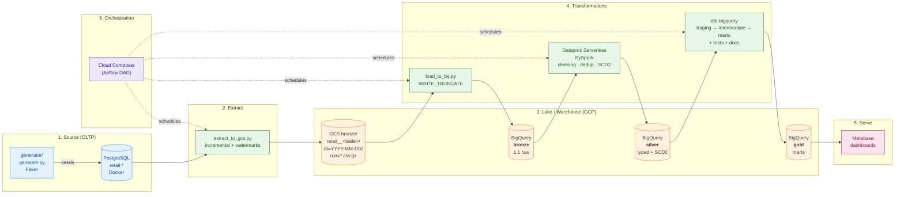
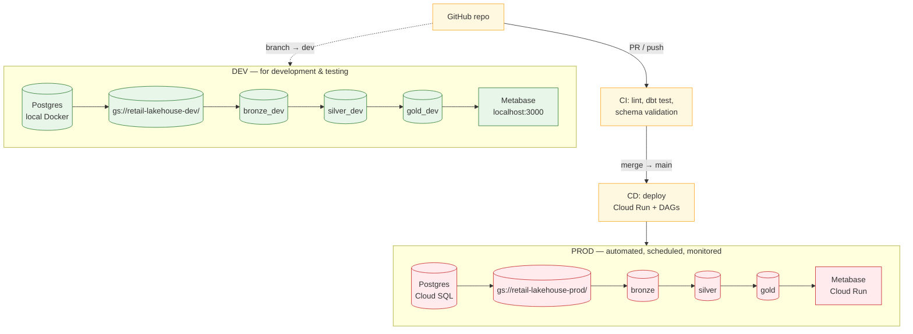
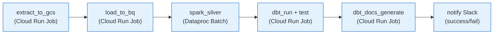

# retail-lakehouse :: End-to-End Architecture

A production-grade analytics lakehouse on GCP that ingests synthetic retail OLTP data, refines it through bronze → silver → gold layers, and serves it to Metabase dashboards. Built with full **dev / prod environment separation**.

---

## 1. Goals

- Treat this like a real engineering job: separate environments, IaC, CI/CD, tests.
- Cover the full lifecycle: **ingest → land → clean → normalize → integrate → aggregate → visualize**.
- Use the right tool per layer: **Python** (extract), **GCS + BigQuery** (storage), **Spark on Dataproc** (heavy transforms / SCD2), **dbt** (business logic & marts), **Metabase** (BI).
- Reproducible: every dataset, table, bucket, and job exists in both `dev` and `prod` with identical structure.

---

## 2. High-Level Architecture



---

## 3. Dev / Prod Environment Design

A **single GCP project** (`retail-496114`) with **naming-based separation** — the cheapest credible way to mirror prod patterns without paying for two projects. Promotion later to a separate prod project is a config swap, not a redesign.

| Resource             | Dev                          | Prod                          |
|----------------------|------------------------------|-------------------------------|
| GCS bucket           | `retail-lakehouse-dev`       | `retail-lakehouse-prod`       |
| BQ dataset (bronze)  | `bronze_dev`                 | `bronze`                      |
| BQ dataset (silver)  | `silver_dev`                 | `silver`                      |
| BQ dataset (gold)    | `gold_dev`                   | `gold`                        |
| Service account      | `retail-pipeline-dev@…`      | `retail-pipeline-prod@…`      |
| dbt target           | `dev`                        | `prod`                        |
| Cloud Run Job        | `retail-extract-dev`         | `retail-extract-prod`         |
| Composer environment | `composer-dev`               | `composer-prod`               |
| Trigger              | manual / on-push to `dev`    | merge to `main` → CI/CD       |

> **Note**: the current code uses `BQ_DATASET=bronze` against `retail-lakehouse-dev`. Rename to `bronze_dev` to match this convention before adding prod.



---

## 4. Layer Breakdown

### 4.1 Source (Postgres OLTP)

Already built. 7 tables in the `retail` schema:

| Table         | Type        | PK              | Key FKs                          | Why interesting downstream                    |
|---------------|-------------|------------------|----------------------------------|-----------------------------------------------|
| `customers`   | Dim         | `customer_id`    | —                                | SCD2 on `status` changes                      |
| `categories`  | Dim         | `category_id`    | self → `parent_category_id`      | Recursive CTE                                 |
| `suppliers`   | Dim         | `supplier_id`    | —                                | Country-level supplier aggregates             |
| `products`    | Dim         | `product_id`     | → categories, suppliers          | SCD2 on price; margin = price − cost          |
| `orders`      | Fact-header | `order_id`       | → customers                      | Status lifecycle (6 states)                   |
| `order_items` | Fact-line   | `order_item_id`  | → orders, products               | Quantity × discounted unit price = line       |
| `payments`    | Fact        | `payment_id`     | → orders                         | AR-aging when no `captured` payment exists    |

### 4.2 Extract (Postgres → GCS bronze)

Already built (`extract/extract_to_gcs.py`):
- **Incremental** via watermark file at `gs://<bucket>/metadata/watermarks.json`.
- Per-table strategy: `timestamp` watermark, `id` watermark, or `full_extract`.
- **Output**: `bronze/retail__<table>/dt=YYYY-MM-DD/run=YYYYMMDD_HHMM.csv.gz` (Hive-partitioned).
- **Idempotent**: same `run_ts` overwrites same blob.

**Next**: containerize for Cloud Run Job; switch dev/prod by env var.

### 4.3 Bronze (GCS → BigQuery raw)

Already built (`extract/load_to_bq.py`):
- Source: all CSV.GZ under the table prefix.
- `WRITE_TRUNCATE` — bronze BQ table = "current snapshot of all GCS files".
- Schema autodetected; GCS is the immutable archive.
- Target: `retail-496114.bronze_dev.bronze_<table>`.

**Decision to revisit**: external table vs. native load.
- **Native load** (current) — cheaper queries, sealed schema, faster scans.
- **External table** — zero-copy, sees new files instantly, slower queries.
- Recommendation: **keep native load** for bronze (downstream Spark/dbt scans it heavily); use external tables only for ad-hoc forensics.

### 4.4 Silver (PySpark on Dataproc Serverless)

**Not yet built** — this is the next major piece.

Why Spark here (not just dbt)?
- **SCD2** is verbose in SQL but natural in Spark `merge` patterns.
- **Schema enforcement**: cast `string → int/decimal/timestamp` with explicit failure handling (CSV autodetect lies sometimes).
- **Deduplication**: bronze can have duplicate rows across `run=*` files for the same logical record. Spark window functions handle "latest per PK" cleanly.
- **Heavy joins** at scale: `order_items × products × categories(recursive)` — dbt does this too, but Spark is the canonical place for it.

**Silver tables produced**:
- `silver_dev.customers_scd2` — historicized customer status (effective_from, effective_to, is_current)
- `silver_dev.products_scd2` — historicized price/cost (margin trackable over time)
- `silver_dev.orders` — typed, deduped
- `silver_dev.order_items` — typed, deduped
- `silver_dev.payments` — typed, deduped
- `silver_dev.categories` — flattened with hierarchy path: `Electronics > Laptops`
- `silver_dev.suppliers` — typed

**How it runs**: PySpark job submitted to Dataproc Serverless via `gcloud dataproc batches submit pyspark` or the `DataprocCreateBatchOperator` in Airflow. No cluster to manage.

### 4.5 Gold (dbt-bigquery)

**Not yet built**.

Project structure:
```
dbt/
├── dbt_project.yml
├── profiles.yml          # dev / prod targets
├── models/
│   ├── staging/          # 1:1 with silver, lightly renamed
│   │   ├── stg_customers.sql
│   │   ├── stg_orders.sql
│   │   └── ...
│   ├── intermediate/     # reusable joins
│   │   ├── int_orders_enriched.sql      # order + customer + lines + product
│   │   └── int_payments_reconciled.sql  # payment vs. order total
│   └── marts/
│       ├── fct_orders.sql               # one row per order, fully enriched
│       ├── fct_revenue_daily.sql        # daily by category × country
│       ├── dim_customer_360.sql         # ltv, first_order, last_order, status, cohort
│       ├── mart_ar_aging.sql            # buckets: 0-30 / 30-60 / 60-90 / 90+
│       ├── mart_product_margin.sql      # cost vs price vs sold price
│       └── mart_category_tree.sql       # recursive walk + level
├── tests/                # singular tests
├── snapshots/            # alternative SCD2 (if not done in Spark)
└── macros/
```

dbt tests on each mart: `not_null`, `unique`, `relationships`, `accepted_values`, plus custom SQL tests (e.g. "no order has line-amount sum ≠ total_amount").

### 4.6 Presentation (Metabase)

Connect Metabase to `gold` dataset only — keep BI users out of bronze/silver.

Dashboards:
- **Executive**: revenue trend, top categories, AR aging summary.
- **Customer**: cohort retention, LTV distribution, churn rate.
- **Operations**: order status funnel, supplier performance, product margins.
- **Finance**: AR aging by bucket, payment method mix, refund rate.

---

## 5. Orchestration



**Tool choice**: **Cloud Composer (Airflow)** for prod, **manual / Task Scheduler** for dev.
- Why not Cloud Workflows? It works, but you lose retries, sensors, the Airflow operator ecosystem, and proper backfills.
- Why not Prefect/Dagster? Fine, but Composer is the GCP-native choice and looks better on a CV than self-hosted alternatives.

**Schedule**: daily at 02:00 UTC. Failure alerts → Slack via webhook.

---

## 6. CI/CD

| Stage           | Trigger              | Actions                                                                          |
|-----------------|----------------------|----------------------------------------------------------------------------------|
| **PR check**    | PR to `main`         | `ruff` + `mypy` on Python · `dbt parse` · `dbt compile` · unit-test Spark        |
| **Dev deploy**  | push to `dev`        | Build Cloud Run image · `dbt run --target dev` · `dbt test --target dev`         |
| **Prod deploy** | merge `dev` → `main` | Build + tag image · upload DAG to Composer · `dbt run --target prod` · smoke test|

**Infra**: Terraform in `infra/` — buckets, datasets, service accounts, Composer env, Cloud Run Jobs. `terraform workspace` for `dev` vs `prod`.

---

## 7. Proposed Repo Layout

```
retail-lakehouse/
├── README.md
├── documentation/
│   └── architecture.md         ← this file
├── db/
│   └── 01_schema.sql
├── generator/
│   ├── generate.py
│   └── requirements.txt
├── extract/
│   ├── extract_to_gcs.py
│   ├── load_to_bq.py
│   ├── Dockerfile              ← (todo) for Cloud Run
│   └── requirements.txt
├── spark/                      ← (todo)
│   ├── jobs/
│   │   ├── silver_customers.py
│   │   ├── silver_products.py
│   │   ├── silver_orders.py
│   │   └── shared/             # SCD2 helpers, IO utils
│   ├── tests/                  # pytest with local Spark
│   └── submit.sh
├── dbt/                        ← (todo)
│   ├── dbt_project.yml
│   ├── profiles.yml
│   ├── models/{staging,intermediate,marts}/
│   └── tests/
├── orchestration/              ← (todo)
│   └── dags/retail_daily.py
├── infra/                      ← (todo)
│   ├── main.tf
│   ├── variables.tf
│   ├── dev.tfvars
│   └── prod.tfvars
├── .github/workflows/          ← (todo)
│   ├── pr-check.yml
│   └── deploy.yml
└── envs/
    ├── dev.env
    └── prod.env
```

---

## 8. Build Roadmap (suggested order)

| # | Step                                                        | Status | Notes                                       |
|---|-------------------------------------------------------------|--------|---------------------------------------------|
| 1 | OLTP schema + generator                                     | ✅     | done                                        |
| 2 | Extract Postgres → GCS                                      | ✅     | done                                        |
| 3 | Load GCS → BQ bronze                                        | ✅     | `bronze_customer` proven                    |
| 4 | Load remaining 6 tables to BQ bronze                        | ⏭     | `python load_to_bq.py --all`                |
| 5 | Rename dataset `bronze` → `bronze_dev` (set prod naming)    | ⏭     | one env var swap                            |
| 6 | First Spark job: `silver_customers` (typed, no SCD2 yet)    | ⏭     | proves the Dataproc Serverless plumbing     |
| 7 | Remaining silver jobs (`orders`, `order_items`, `payments`) | ⏭     |                                             |
| 8 | SCD2 on `customers` + `products`                            | ⏭     | the headline Spark pattern                  |
| 9 | dbt scaffold + staging models                               | ⏭     |                                             |
|10 | dbt marts (`fct_orders`, `fct_revenue_daily`, …)            | ⏭     |                                             |
|11 | dbt tests + dbt docs                                        | ⏭     |                                             |
|12 | Metabase pointed at `gold_dev`, build 4 dashboards          | ⏭     |                                             |
|13 | Airflow DAG chaining all steps                              | ⏭     |                                             |
|14 | Terraform for dev resources                                 | ⏭     |                                             |
|15 | Promote: create `prod` bucket/datasets/SAs via TF           | ⏭     |                                             |
|16 | CI/CD: GitHub Actions for PR check + deploy                 | ⏭     |                                             |
|17 | Monitoring: Cloud Monitoring alerts on DAG failures         | ⏭     |                                             |

---

## 9. Decisions Worth Knowing Up Front

1. **CSV.GZ over Parquet for bronze**: chosen to avoid pyarrow/pandas in the extractor and load straight into BQ. Trade-off: no schema in the file, slower scans. Acceptable because BQ owns the typed copy.
2. **Bronze = WRITE_TRUNCATE, not append**: GCS is the archive; BQ bronze always reflects the union of all CSVs. Silver does the dedup, so duplicate runs are harmless.
3. **Silver = Spark, not dbt**: SCD2 + heavy cleaning belong in Spark. dbt picks up from typed, deduped silver data — that's where SQL shines.
4. **Single project, dataset-naming separation**: cheaper than two projects and the standard pattern in mid-size shops. Migrate to two projects when prod has real users.
5. **No streaming**: this is a batch lakehouse. If streaming were required, you'd add Pub/Sub + Dataflow between Postgres CDC and GCS — out of scope for now.
