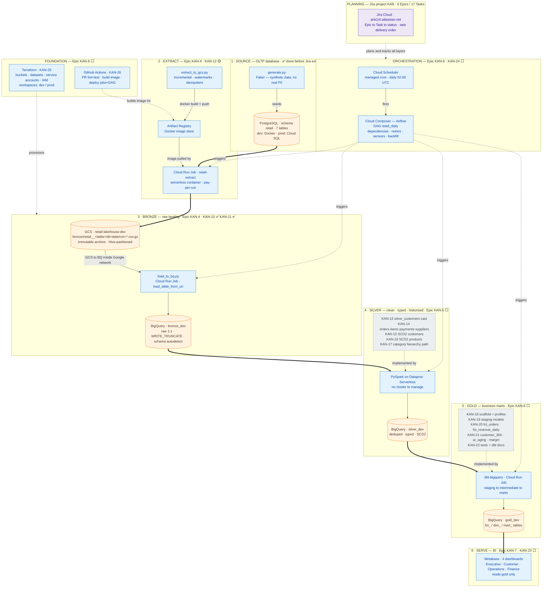
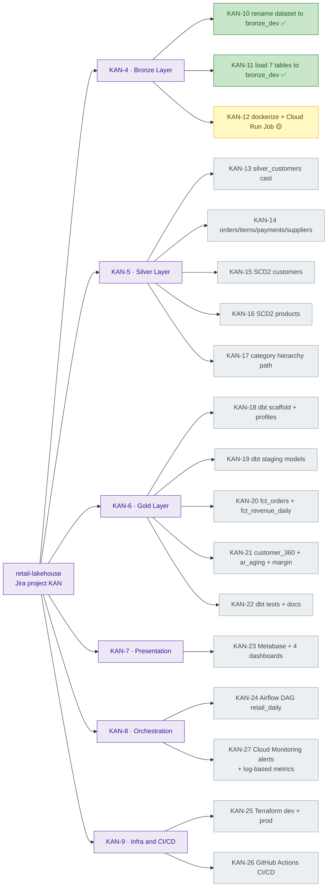

# retail-lakehouse :: Master Project Map

One page that holds the **whole project** at once: the data pipeline from extract to gold,
the GCP tool behind every stage, **why** that tool was chosen, and how each stage maps to a
Jira ticket. The smaller per-topic diagrams in [`architecture.md`](architecture.md) still
stand — this file is the single bird's-eye view on top of them.

Status legend used everywhere below: ✅ done · 🟡 in progress · ⬜ to do

---

## 1. Master Pipeline Blueprint

The full system in one diagram — six data layers (the spine), plus the three cross-cutting
layers that wrap it: **planning** (Jira), **orchestration** (Scheduler + Composer), and
**foundation** (Terraform + GitHub Actions). Each layer's title carries its Jira Epic key.



**How to read it:** the thick arrows are the data spine — a row physically moves
Postgres → GCS → BigQuery bronze → silver → gold → Metabase. The dotted arrows are
*control*, not data: Composer **triggers** jobs, Terraform **provisions** the resources
those jobs write into, Jira **tracks** the work. Data never flows through the dotted lines.

---

## 2. Why Each Tool — and What Breaks Without It

The point of the project is to meet the GCP toolset. For every box above, here is the
job it does, why it (and not an alternative) was picked, and the consequence of removing it.

| Stage | Tool | Why this one | Remove it and… |
|---|---|---|---|
| Source | **Faker** (`generate.py`) | Generates realistic fake retail rows so the whole pipeline runs on **zero real PII** — safe for a public portfolio. | You'd need a real dataset: privacy risk, licensing, can't publish. |
| Source | **PostgreSQL** | A row-oriented, transactional DB — mirrors the real on-prem operational system a lakehouse must extract *from*. | No realistic source shape; you'd be "transforming" data that never lived in an OLTP system. |
| Source (prod) | **Cloud SQL** | Managed PostgreSQL — Google runs backups, patching, failover. | You self-manage a Postgres VM: patching, disk, HA all become your job. |
| Extract | **`extract_to_gcs.py`** (Python) | The extract logic is bespoke (watermarks, per-table modes) — a hand-written script teaches more and costs nothing. | A managed connector (Datastream, Fivetran) — paid, less control, less learning. |
| Bronze | **Cloud Storage (GCS)** | Cheap, immutable object store = the **archive**. Decouples extract from load, survives a BQ table drop, Hive-partitioned for cheap re-loads. | Extract straight into BQ — you lose the replayable archive and the extract/load split. |
| Extract/Bronze | **Artifact Registry** | Private, in-region, **versioned** store for the Docker images Cloud Run runs. | Cloud Run has no image to pull — nothing to deploy. |
| Extract/Bronze | **Cloud Run Jobs** | Serverless container, **run-to-completion, $0 when idle** — the exact shape of a finite batch job. | A VM on cron (idle cost + ops) or GKE (cluster to babysit). |
| Orchestration | **Cloud Scheduler** | Managed cron — the single timer that kicks off the pipeline. | A machine must stay powered on just to run `cron`. |
| Warehouse | **BigQuery** | Serverless columnar warehouse; storage and compute are separate; loads CSV from GCS **natively**; SQL at any scale. Home of bronze/silver/gold. | You'd size and tune your own warehouse cluster (vacuum, distribution keys, scaling). |
| Silver | **Dataproc Serverless** (PySpark) | Runs Spark with **no standing cluster**. SCD2, dedup via window functions, heavy joins — verbose in SQL, natural in Spark. | Do silver in pure SQL (SCD2 gets painful) or manage a Spark cluster yourself. |
| Gold | **dbt-bigquery** | SQL transformation framework: models, `ref()`, tests, docs, lineage — all version-controlled. The business-logic layer. | Loose hand-written SQL: no tests, no lineage graph, no generated docs. |
| Serve | **Metabase** | Open-source BI — point-and-click dashboards straight on BigQuery. | No serving layer; stakeholders hand-write SQL to answer questions. |
| Orchestration | **Cloud Composer (Airflow)** | Managed Airflow — DAG **dependencies, retries, sensors, backfills**, run history. Chains extract→load→spark→dbt with real failure handling. | A chain of schedulers with no dependency awareness — step 3 runs even when step 2 failed. |
| Foundation | **Terraform** | Infrastructure as code — every bucket/dataset/SA defined in files, applied **identically to dev and prod**. | Click-ops in the console: not reproducible, no review, dev/prod silently drift. |
| Foundation | **GitHub Actions** | CI/CD — on PR run lint+tests; on merge build the image and deploy jobs + DAG. | Manual `docker build` / `gcloud deploy` on every change (fine solo, doesn't scale). |
| Planning | **Jira** | Turns the architecture roadmap into trackable Epics and Tasks with status and order. | The roadmap lives only in a doc — no progress signal, no "what's next". |

---

## 3. Jira Delivery Map (Epic → Task)

The same project seen as **planned work**. 6 Epics, one per pipeline layer; 18 Tasks beneath
them — including **KAN-27**, created to close the monitoring gap (see §4).



---

## 4. Jira vs. Development Flow — Match Check & Reconstruction

Every Jira task mapped to its pipeline stage and to the 17-step roadmap in `architecture.md §8`.

| Jira | Task | Stage | Roadmap step | Verdict |
|---|---|---|---|---|
| KAN-10 | rename dataset → `bronze_dev` | Bronze | 5 | ✅ matches · **Done** |
| KAN-11 | load 7 tables → `bronze_dev` | Bronze | 4 | ✅ matches · **Done** |
| KAN-12 | dockerize extractor + Cloud Run (dev) | Extract | — | ⚠️ scope — note A |
| KAN-13 | `silver_customers` typed cast | Silver | 6 | ✅ matches |
| KAN-14 | silver orders/items/payments/suppliers | Silver | 7 | ✅ matches |
| KAN-15 | SCD2 customers | Silver | 8 | ✅ matches |
| KAN-16 | SCD2 products | Silver | 8 | ✅ matches |
| KAN-17 | category hierarchy path | Silver | (doc §4.4) | ✅ matches |
| KAN-18 | dbt scaffold + profiles | Gold | 9 | ✅ matches |
| KAN-19 | dbt staging models | Gold | 9 | ✅ matches |
| KAN-20 | marts: fct_orders + fct_revenue_daily | Gold | 10 | ✅ matches |
| KAN-21 | marts: customer_360 + ar_aging + margin | Gold | 10 | ✅ matches |
| KAN-22 | dbt tests + docs | Gold | 11 | ✅ matches |
| KAN-23 | Metabase + 4 dashboards | Serve | 12 | ✅ matches |
| KAN-24 | Airflow DAG `retail_daily` | Orchestration | 13 | ✅ matches |
| KAN-25 | Terraform dev + prod | Foundation | 14 + 15 | ⚠️ bundles two — note B |
| KAN-26 | GitHub Actions CI/CD | Foundation | 16 | ✅ matches |
| KAN-27 | Cloud Monitoring alerts + log-based metrics | Orchestration | 17 | ✅ added — note C |

**Verdict: the board matches the flow well.** With KAN-27 added, 16 of 18 tasks line up
cleanly. Three findings came out of the check — one fixed, two left as known observations:

- **Note A — KAN-12 scope.** Titled *"dockerize **extractor**… (dev)"*, but the pipeline runs
  **two** Cloud Run Jobs — `extract_to_gcs.py` *and* `load_to_bq.py`. Recommend re-titling to
  *"Containerise extract + load jobs, deploy to Cloud Run (dev)"* so the load job isn't lost.
  Prod deployment is fine to fold into KAN-25.
- **Note B — KAN-25 bundles two roadmap steps** (14 = dev infra, 15 = promote to prod). Big
  but acceptable as one task; optionally split into `KAN-25 Terraform (dev)` and a new
  `KAN-? Terraform promote to prod`.
- **Note C — Monitoring (resolved ✅).** Roadmap step 17 ("Cloud Monitoring alerts on DAG
  failures") had **no Jira task**. Now created as **KAN-27** under Epic KAN-8 and assigned
  to you — the monitoring gap is closed.

> Source layer (schema, generator, extractor) has no Epic — it was built before Jira existed.
> Purely cosmetic; a closed "Phase 0" epic would make the board 100% complete, or leave as-is.

---

## 5. Where We Are Right Now

```
✅ Source (Postgres + 7 tables + generator)
✅ Extract script + Bronze load script        ← KAN-10, KAN-11 done
🟡 Containerise + Cloud Run deploy             ← KAN-12 IN PROGRESS  ← you are here
⬜ Silver (Dataproc/PySpark)                    ← KAN-13 next
⬜ Gold (dbt) → Serve (Metabase)
⬜ Orchestration (Composer) → Foundation (Terraform, GitHub Actions)
```

**Immediate next step:** finish KAN-12 — write the `Dockerfile`, push the image to Artifact
Registry, create the Cloud Run Job, and wire Cloud Scheduler to it.
